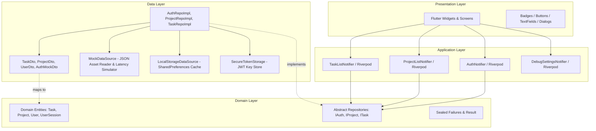
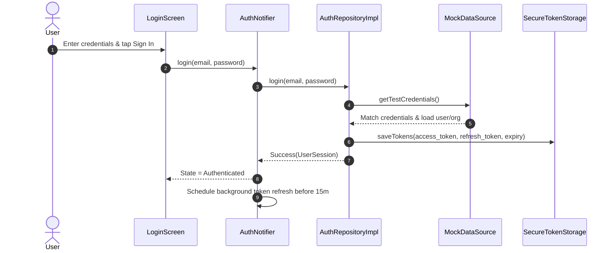

# TaskFlow Architecture Specification

## Clean Layered Architecture Diagram

```mermaid
graph TD
    subgraph Presentation Layer
        UI[Flutter Widgets & Screens]
        Components[Badges / Buttons / TextFields / Dialogs]
    end

    subgraph Application Layer
        AuthProvider[AuthNotifier / Riverpod]
        ProjectProvider[ProjectListNotifier / Riverpod]
        TaskProvider[TaskListNotifier / Riverpod]
        DebugProvider[DebugSettingsNotifier / Riverpod]
    end

    subgraph Domain Layer
        Entities[Domain Entities: Task, Project, User, UserSession]
        RepoInterfaces[Abstract Repositories: IAuth, IProject, ITask]
        Failures[Sealed Failures & Result<T>]
    end

    subgraph Data Layer
        RepoImpl[AuthRepoImpl, ProjectRepoImpl, TaskRepoImpl]
        DTOs[TaskDto, ProjectDto, UserDto, AuthMockDto]
        MockDS[MockDataSource - JSON Asset Reader & Latency Simulator]
        LocalDS[LocalStorageDataSource - SharedPreferences Cache]
        SecureDS[SecureTokenStorage - JWT Key Store]
    end

    UI --> AuthProvider
    UI --> ProjectProvider
    UI --> TaskProvider
    UI --> DebugProvider

    AuthProvider --> RepoInterfaces
    ProjectProvider --> RepoInterfaces
    TaskProvider --> RepoInterfaces

    RepoImpl -. implements .-> RepoInterfaces
    RepoImpl --> MockDS
    RepoImpl --> LocalDS
    RepoImpl --> SecureDS
    RepoImpl --> DTOs
    DTOs -. maps to .-> Entities
```

## Sequence Diagram: Authentication & Token Refresh

```mermaid
sequenceDiagram
    autonumber
    actor User
    participant LoginScreen
    participant AuthNotifier
    participant AuthRepositoryImpl
    participant MockDataSource
    participant SecureTokenStorage

    User->>LoginScreen: Enter credentials & tap Sign In
    LoginScreen->>AuthNotifier: login(email, password)
    AuthNotifier->>AuthRepositoryImpl: login(email, password)
    AuthRepositoryImpl->>MockDataSource: getTestCredentials()
    MockDataSource-->>AuthRepositoryImpl: Match credentials & load user/org
    AuthRepositoryImpl->>SecureTokenStorage: saveTokens(access_token, refresh_token, expiry)
    AuthRepositoryImpl-->>AuthNotifier: Success(UserSession)
    AuthNotifier-->>LoginScreen: State = Authenticated
    AuthNotifier->>AuthNotifier: Schedule background token refresh before 15m
```
