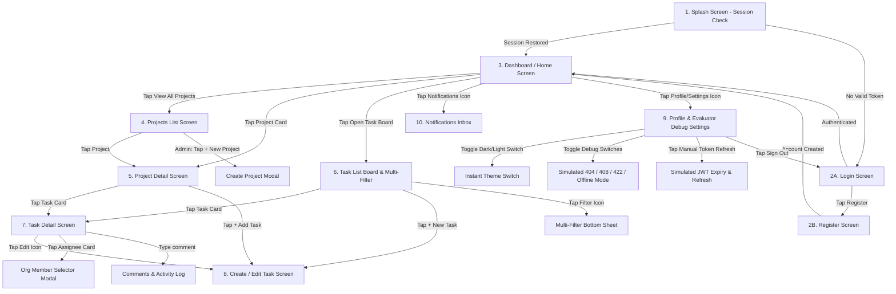

# TaskFlow — Production-Grade Flutter Technical Assessment Application

TaskFlow is a project management mobile application built with **Flutter & Dart** following **Clean Architecture (SOLID principles)**, reactive state management using **Riverpod**, simulated authentication with JWT access/refresh token rotation, local storage caching, role-based access control (RBAC), and interactive evaluator debugging controls.

---

## 📱 Complete End-to-End User Flow & Screen Navigation

TaskFlow guides users through a clear, intuitive project management workflow:



---

## 🗺️ Screen-by-Screen User Guide

### 1. Splash Screen (`splash_screen.dart`)
- **How it works**: Automatically checks secure storage (`SecureTokenStorage`) on application startup.
- **Flow**: If a valid session or refreshable token exists, auto-logs the user in and navigates to the **Dashboard Screen**. If no session exists, navigates to the **Login Screen**.

### 2. Login & Registration Screens (`login_screen.dart` & `register_screen.dart`)
- **Client-Side Validation**: Validates required inputs, email format, and password length.
- **Password Eye Toggle**: Eye icon button (`visibility_off` / `visibility`) on password fields allows users to toggle password visibility (hidden by default).
- **Evaluator Quick-Fill Chips**: One-tap test credential chips on the Login screen to log in instantly as Org A Admin, Org A Member, Org B Admin, or Org B Member.

### 3. Dashboard / Home Screen (`dashboard_screen.dart`)
- **Organization Header**: Displays active user name, email, avatar, and Role badge (`Admin` vs `Member`).
- **Task Summary Breakdown**: Live counters for tasks in `To Do`, `In Progress`, `In Review`, and `Completed`.
- **Top App Bar Quick Actions**:
  - 🌙 / ☀️ **Theme Toggle**: Instantly switch between Light Mode and Dark Mode.
  - 🔔 **Notifications Icon**: Badge counter showing unread assignment notifications.
  - ⚙️ **Settings Icon**: Opens Profile & Evaluator Debug Settings.

### 4. Projects List Screen (`project_list_screen.dart`)
- **Org-Scoped Projects**: Displays projects belonging to the logged-in user's organization (`org_id`).
- **Role-Based Admin Guard**: Only Organization Admins (`org_admin`) see the `+ New Project` floating action button and project delete actions.

### 5. Project Detail Screen (`project_detail_screen.dart`)
- **Overview Card**: Displays project description and status badge.
- **Mini Task Summary Grid**: Live counts of project tasks grouped by status.
- **Project Tasks**: Filtered list of tasks specific to this project.

### 6. Task List Board & Multi-Filter (`task_list_screen.dart`)
- **Live Search Bar**: Search tasks by title or keyword.
- **Multi-Criteria Filter Sheet**: Filter tasks by:
  - **Status** (`todo`, `in_progress`, `review`, `done`)
  - **Priority** (`low`, `medium`, `high`, `urgent`)
  - **Assignee** (filtered to active organization members)
  - **Due Date Range** (Interactive Date Range Picker)
- **Active Filter Chips**: Horizontally scrollable chips showing active filters with one-tap removal.

### 7. Task Detail Screen (`task_detail_screen.dart`)
- **Inline Pickers**: Tap status badge or priority badge to change task status/priority inline.
- **Assignee Selector Modal**: Tap Assignee card to assign or unassign team members.
  - *Business Logic Guard*: Prevents assigning members from outside the active organization.
- **Comments & Activity Thread**: View comments and post new comments in real-time.

### 8. Create / Edit Task Screen (`create_edit_task_screen.dart`)
- Form to create new tasks or update existing tasks (Title, Description, Project, Priority, Status, Assignee, and Due Date Picker).

### 9. Profile & Evaluator Debug Settings (`profile_settings_screen.dart`)
- **User Profile Card**: Displays user avatar, email, organization ID, and role.
- **Appearance Settings**: Toggle between Light Theme and Dark Theme.
- **Simulated JWT Session Status**: Displays token expiry time, auto-refresh status, and a button to trigger manual token refresh.
- **Evaluator Debug Control Panel**: Interactive toggles for:
  - **Simulate Offline Mode** (Shows sticky warning banner and loads cached data from `SharedPreferences`).
  - **Simulate 404 Not Found**
  - **Simulate 408 Network Timeout**
  - **Simulate 422 Payload Validation Error**
  - **Artificial Network Latency Slider (0 – 1500 ms)**

### 10. Notifications Inbox (`notifications_screen.dart`)
- List of task assignment notification alerts. Tapping a notification marks it as read and opens the corresponding task.

---

## 🔐 Test Credentials Table

Reviewers can test role-based permissions and multi-organization behavior using these credentials:

| Organization | Role | Name | Email | Password |
| :--- | :--- | :--- | :--- | :--- |
| **Nimbus Digital** (`org_a1b2c3`) | Admin | **Aditya Sharma** | `aditya.admin@nimbusdigital.test` | `Password123!` |
| **Nimbus Digital** (`org_a1b2c3`) | Member | **Ramesh Kumar** | `ramesh.member@nimbusdigital.test` | `Password123!` |
| **Nimbus Digital** (`org_a1b2c3`) | Member | **Rinki Patel** | `rinki.member@nimbusdigital.test` | `Password123!` |
| **Harborlight Studios** (`org_d4e5f6`) | Admin | **Shivani Verma** | `shivani.admin@harborlightstudios.test` | `Password123!` |
| **Harborlight Studios** (`org_d4e5f6`) | Member | **Arzzoo Khan** | `arzzoo.member@harborlightstudios.test` | `Password123!` |

> 💡 **Quick Fill**: Tap any credential chip on the Login screen to auto-fill email and password!

---

## 🏗️ Architecture & Layering Overview

TaskFlow strictly enforces **Clean Layered Architecture**:

```
d:\Assignment\
├── assets/
│   └── mock_data/
│       └── TaskFlow-MockData.json
├── lib/
│   ├── core/
│   │   ├── constants/       # AppColors, AppTypography
│   │   ├── errors/          # Sealed Failures hierarchy
│   │   ├── theme/           # Light & Dark Material 3 ThemeData
│   │   └── utils/           # Functional Result<T> pattern
│   ├── data/
│   │   ├── datasources/     # MockDataSource, LocalStorageDataSource, SecureTokenStorage
│   │   ├── models/          # DTOs with JSON serialization
│   │   └── repositories/    # Repository implementations
│   ├── domain/
│   │   ├── entities/        # Pure Dart Domain Entities (TaskEntity, Project, User)
│   │   └── repositories/    # Abstract Repository Interfaces
│   ├── presentation/
│   │   ├── providers/       # Riverpod Providers (Auth, Projects, Tasks, Theme, Debug)
│   │   ├── screens/         # All 11 application screens
│   │   └── widgets/         # Reusable Badges, Buttons, Inputs, Dialogs
│   └── main.dart
└── test/
    ├── unit/                # Repository, Auth, and Filter unit tests
    ├── widget/              # Login form & badge widget tests
    └── integration/         # App launch & integration tests
```

---

## 🛠️ How to Run & Test

### Prerequisites
- **Flutter SDK**: `^3.32.5`
- **Dart SDK**: `^3.8.1`

### Commands

1. **Install Dependencies**:
```bash
flutter pub get
```

2. **Run Application**:
```bash
flutter run
```

3. **Run Automated Test Suite**:
```bash
flutter test
```

4. **Build Production Release APK**:
```bash
flutter build apk --release
```

---

## 🧪 How to Test Evaluator Debug & Error Features

1. Log in with any test credential (e.g. `aditya.admin@nimbusdigital.test`).
2. Open **Profile & Settings** (gear icon in Dashboard top right).
3. Under **Evaluator Debug Control Panel**:
   - **Offline Mode**: Toggle on "Simulate Offline Mode". Notice the sticky warning banner at the top of screens. Data continues loading smoothly from local `SharedPreferences` cache.
   - **404 / 408 / 422 Errors**: Toggle any error switch, then return to Dashboard or Tasks and pull-to-refresh to view the retryable error UI state.
   - **Manual Token Refresh**: Tap "Simulate Manual Token Refresh Now" to issue a new JWT access token.
   - **Dark Mode**: Tap the Theme toggle switch to switch between Light Mode and Dark Mode.
